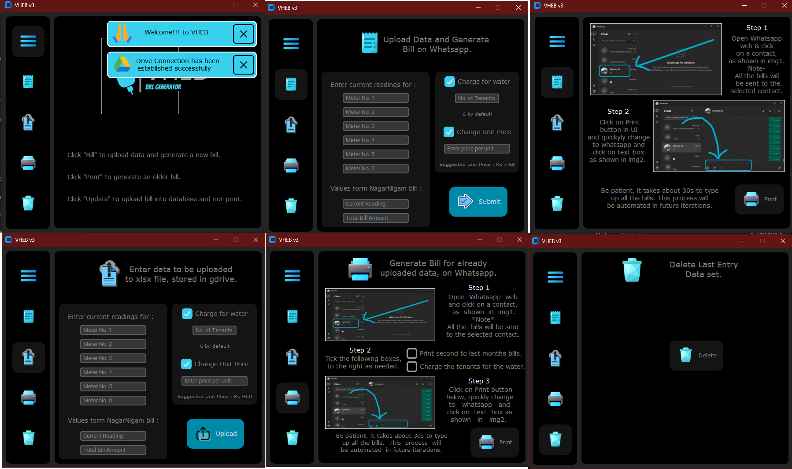

# VHEB v3 - Automated Electricity Bill Manager



VHEB (Virtual Home Electricity Biller) is a desktop application designed to automate the process of calculating, splitting, and distributing electricity bills among multiple tenants or sub-meters. It uses a central Excel (`.xlsx`) file stored on Google Drive as its database, allowing for easy access and data persistence.

The application features a modern, dark-themed UI built with `customtkinter` and leverages `pyautogui` to automate sending formatted bill summaries to tenants via WhatsApp.

\!

## Features

  - **Cloud Sync:** Automatically downloads the latest billing sheet from Google Drive on startup and uploads the updated version after making changes.
  - **Automated Calculations:** Takes current meter readings for multiple sub-meters and the main utility bill to calculate consumption and cost for each tenant.
  - **Water Bill Splitting:** Optionally splits a shared water bill cost evenly among a specified number of tenants.
  - **WhatsApp Automation:** Generates and types out pre-formatted, detailed bills into a selected WhatsApp chat, saving you the manual effort of typing.
  - **Data Management:**
      - **Bill & Print:** Update the database with new readings and immediately generate bills.
      - **Update Only:** Add a new data entry to the database without printing bills.
      - **Print Historical:** Generate WhatsApp bills from previous entries in the database.
      - **Delete Entry:** Safely remove the most recent data entry.
  - **Smart Price Suggestion:** Recommends a price-per-unit to charge tenants based on the total utility bill amount and a configurable profit margin.

## Prerequisites

  - Python 3.7 or newer.
  - A Google Account for Google Drive API access.

## Installation & Setup

Follow these steps to get the application running on your local machine.

### 1\. Clone the Repository

```bash
git clone https://github.com/your-username/your-repository-name.git
cd your-repository-name
```

### 2\. Install Dependencies

It is recommended to use a virtual environment.

```bash
# Create and activate a virtual environment (optional but recommended)
python -m venv venv
source venv/bin/activate  # On Windows, use `venv\Scripts\activate`

# Install the required libraries
pip install customtkinter openpyxl Pillow "google-api-python-client>=2.52.0" "google-auth-httplib2>=0.1.0" "google-auth-oauthlib>=0.5.1" pyautogui
```

### 3\. Set Up Google Drive API

The application needs access to your Google Drive to read and write the `Electricity.xlsx` file.

1.  Go to the [Google Cloud Console](https://console.cloud.google.com/).
2.  Create a new project (e.g., "VHEB Biller").
3.  Go to **APIs & Services \> Library**, search for **Google Drive API**, and **Enable** it.
4.  Go to **APIs & Services \> Credentials**.
5.  Click **+ CREATE CREDENTIALS** and select **OAuth client ID**.
6.  Choose **Desktop app** as the application type and give it a name.
7.  Click **CREATE**. A window will appear with your Client ID and Client Secret. Click **DOWNLOAD JSON**.
8.  Rename the downloaded file to `credentials.json` and place it in the root directory of the project.
9.  **First Run:** The first time you run the script, a browser window will open asking you to authorize the application. Log in with your Google account and grant permission. A `token.json` file will be created in the project directory, which stores your authorization for future runs.

### 4\. Prepare the Excel File

1.  Create an `Electricity.xlsx` file with the required format for your billing needs. The script is designed to find the last-filled columns and add new data next to them.

2.  Upload this file to your Google Drive.

3.  Open the file in Google Drive and get its ID from the URL. The URL will look like: `https://docs.google.com/spreadsheets/d/THIS_IS_THE_FILE_ID/edit`.

4.  Copy the `FILE_ID` and paste it into the script, replacing the placeholder value:

    ```python
    File_Id = 'YOUR_FILE_ID_HERE'
    ```

### 5\. Add UI Assets

Create an `assets` folder in the root directory and place all the `.png` image files used by the UI inside it (e.g., `bill.png`, `upload.png`, `logo.png`, etc.).

## How to Use

1.  **Run the application:**

    ```bash
    python main.py  # or your script's filename
    ```

2.  The app will start and automatically download the `Electricity.xlsx` file from your Google Drive.

3.  **To Generate a New Bill:**

      - Click the **Bill** icon on the sidebar.
      - Enter the current readings for all sub-meters.
      - Enter the total reading and bill amount from the main utility bill.
      - Tick the checkboxes if you need to charge for water or set a custom price per unit.
      - Click **Submit**.

4.  **To Send Bills on WhatsApp:**

      - After submitting, a new screen will appear with instructions.
      - Open [suspicious link removed] or the WhatsApp Desktop app.
      - Open the chat for the contact or group where you want to send the bills. **Click inside the message typing box.**
      - Switch back to the VHEB app and click the **Print** button.
      - The app will begin a 10-second countdown. During this time, switch back to WhatsApp and make sure the cursor is active in the message box.
      - The script will then automatically type and send the formatted bills for all tenants.

5.  **Other Options:**

      - **Update:** Updates the database with new readings but does not proceed to the WhatsApp printing screen.
      - **Print:** Generates bills on WhatsApp using the most recent data entry in the spreadsheet.
      - **Delete:** Removes the last set of readings from the spreadsheet and syncs the change to Google Drive.

## Code Overview

  - **`__main__()`**: The main function that initializes the `customtkinter` UI, defines the layout, and handles button click events.
  - **`file_download()` / `file_upload()`**: Manages the connection to the Google Drive API for downloading and uploading the `Electricity.xlsx` file.
  - **`update_xlsheet()` / `read_xlsheet()`**: Core functions that use `openpyxl` to read data from and write new calculations to the Excel file.
  - **`whatsapp_processing()`**: Contains the `pyautogui` logic to automate typing messages into WhatsApp.
  - **`suggested_unitprice()`**: A helper function to calculate a recommended unit price based on the last main bill.

-----